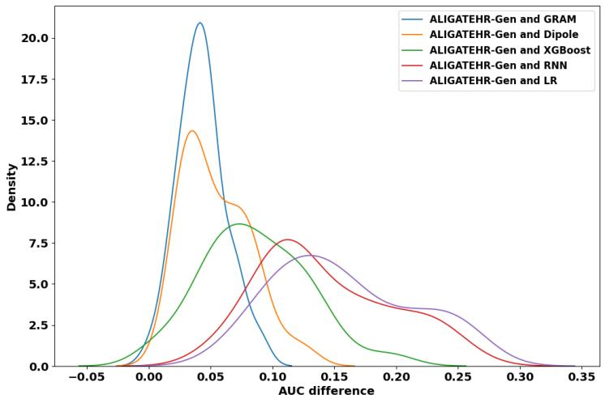
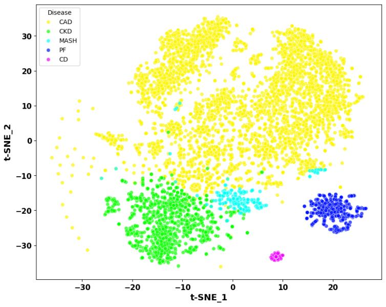
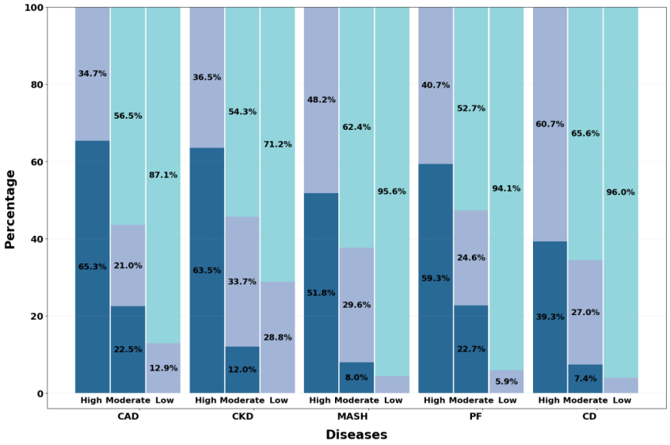
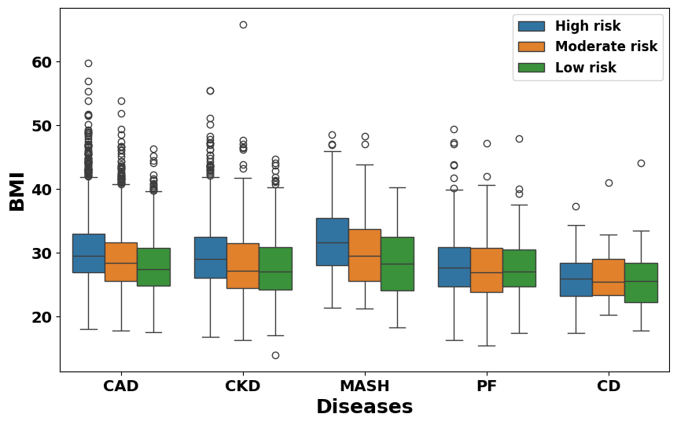

## Introduction

The modern healthcare system has been transformed by the proliferation of diverse data sources and multimodal patient information [@liu2025challenges; @acosta2022multimodal]. Advances in digital health technologies and biomedical research have fostered a data-rich environment where electronic health records (EHR) and genetic data offer unprecedented opportunities to advance genomic medicine. EHRs serve as digitized repositories of patients' medical histories, including consultations, diagnoses, procedures, laboratory tests, and prescribed medications, while genetic data provides a comprehensive view of patients' genomic profiles, enabling the assessment of genetic contributions to disease risk [@xu2021quantitative].

The integration of multimodal data in EHR has facilitated the development of machine learning-based disease risk prediction models. In particular, deep learning architectures, such as recurrent neural networks (RNN) [@choi2016doctor; @choi2016multi], graph neural networks (GNN) [@khemani2024review], and transformers [@yang2023transformehr], have demonstrated great potential in enhancing diagnostic predictions from EHR, suggesting the power of multimodal data integration in predictive healthcare analytics. Despite the considerable progress in predictive modeling across data modalities in EHR [@waqas2024deep], the use of genetic information into clinical risk assessment remains limited. The convergence of EHR and genetic data presents a unique opportunity for a synergistic approach to patient modeling, where clinical insights from EHR are enriched by genetic contributions to disease susceptibility.

Family health history is an important component to assess risk for common chronic diseases, because families share genetic variations, environmental exposures, common lifestyle, and health-related social factors. Unfortunately, family health history is often missing or inconsistently recorded in EHR databases [@ginsburg2019family]. To address this limitation, we previously developed ALIGATEHR, which models the inferred family relations from de-identified demographic data in a graph attention network augmented with an attention-based medical ontology representation [@huang2025enhancing]. By accounting for the complex influence of genetics, shared environmental exposures, and disease dependencies, ALIGATEHR enhances patient representation learning.

Large-scale biobanks, such as the UK Biobank (UKB) [@bycroft2018uk], have become invaluable resources for investigating the role of genetics and its interplay with other factors in human health. By linking decades of EHR with genetic data, these biobanks provide a robust platform for assessing the risk of common diseases. The availability of genome-wide single nucleotide polymorphism (SNP) data enables the identification of familial relationships among participants.

In this work, we introduce **ALIGATEHR-Gen** (ALIgning Graph Attention neTworks for EHR using Genetic kinship), a generic framework for learning patient representations to enhance disease risk prediction by integrating EHR and genetic data. ALIGATEHR-Gen learns patient representations in a graph attention network to account for family health history based on genetically inferred relationships. To further enhance the quality of the learned representations by accounting for misdiagnosis and disease dependencies, we additionally integrate a medical ontology of embedded diagnosis codes into the attention mechanism.

### Core Contributions

- We introduce an attention-based GNN framework, ALIGATEHR-Gen, for disease risk prediction. To the best of our knowledge, it is the first attention-based GNN model that integrates clinical features and genetic data for disease risk prediction, using genetically inferred first-degree relationships as graph edges.
- We demonstrate that ALIGATEHR-Gen outperforms state-of-the-art baseline models across a broad spectrum of diseases in a large-scale real-world biobank dataset, the UKB. The ablation experiment confirms the robustness of our model.
- We show ALIGATEHR-Gen's ability to distinguish patient subgroups across five primary fibrotic or closely related diseases: coronary artery disease, chronic kidney disease, metabolic dysfunction-associated steatohepatitis, pulmonary fibrosis, and Crohn's disease.

## Methods

@fig-architecture presents an overview of the ALIGATEHR-Gen framework, which consists of four main components: data processing, graph construction, an attention layer, and a prediction layer.

{#fig-architecture}

### Data Processing

We use data from the UKB, which includes over 500,000 participants. Among them, 206,831 have both de-identified EHR, including both primary care and hospital inpatient data, and genetic data. Primary care data, released in 2019, capture participants' diagnosis history up to 2016 or 2017, while hospital inpatient data provide information on hospital admissions through 2022. Genetic data were released in 2017. Within this cohort, 63,693 participants have genetically inferred third-degree or closer relatives, and 22,364 have genetically inferred first-degree relatives.

### Demographics of Experimental Population {#sec-demographics}

| Statistics | UKB | CAD | CKD | MASH | PF | CD |
|:-----------|:---:|:---:|:---:|:----:|:--:|:--:|
| Number of participants | 22,364 | 5003 | 1275 | 220 | 456 | 71 |
| Female | 60% | 33% | 51% | 46% | 48% | 53% |
| Male | 40% | 67% | 49% | 54% | 52% | 47% |
| Age at recruitment (mean) | 56.9 | 61.3 | 62.1 | 58.3 | 56.8 | 56.3 |
| Age at first diagnosis (mean) | -- | 64.6 | 69.9 | 64.6 | 69.5 | 60.2 |
| Number of visits per patient (mean) | 23.3 | 36.1 | 52.6 | 44.4 | 40.4 | 40.0 |
| Number of unique ICD codes per patient (mean) | 24.5 | 43.8 | 54.5 | 52.9 | 46.1 | 41.3 |
| Number of ICD codes per visit (mean) | 2.4 | 3.2 | 3.4 | 3.5 | 3.2 | 2.7 |

: Demographics of experimental population. UKB: participants with first-degree relatives in UK Biobank; CAD: coronary artery disease; CKD: chronic kidney disease; MASH: metabolic dysfunction-associated steatohepatitis; PF: pulmonary fibrosis; CD: Crohn's disease. {#tbl-demographics}

### Graph Construction

ALIGATEHR-Gen constructs two graphs: a **patient graph** constructed from genetic kinship and an **ontology graph** derived from medical ontology.

**Patient Graph.** To characterize familial relatedness within the UKB participants, kinship coefficients are estimated by UKB for all pairs of samples using genome-wide SNP data. The kinship coefficient represents the probability that a randomly selected allele from one individual is identical by descent (IBD) with an allele at the same locus from another individual and provides a measure of relatedness between pairs of individuals. First-degree relatives are defined as pairs with a kinship coefficient larger than or equal to 0.177. Based on these inferred relationships, a patient graph is then built by connecting first-degree relatives within the cohort.

**Ontology Graph.** In medical ontologies, the hierarchy of various medical concepts is often represented through a parent-child relationship, with diagnosis codes serving as leaf nodes. The ontology graph is modeled as a directed acyclic graph (DAG), in which parent nodes represent more general medical concepts, while child nodes represent more specific subcategories.

### Attention Layer

**Patient Graph Attention.** In the patient graph, each node (patient) has an associated feature vector representing a patient's disease status, denoted as $h_i \in \mathbb{R}^C$, with $|C|$ being the total number of unique diagnosis codes in the EHR data. Between the nodes, an attention mechanism links a patient's representation to the clinical profiles of their relatives:

$$h'_i = \sigma\left(\sum_{j \in \mathcal{N}_i} \alpha'_{ij} W_e h_j\right)$$

where $h'_i \in \mathbb{R}^C$ denotes the final representation of patient $i$, $\sigma$ applies a ReLU activation function, $\mathcal{N}_i$ contains indices of patient $i$'s first-degree relatives, $W_e$ is the weight matrix, and the attention coefficient $\alpha'_{ij}$ is calculated by the softmax function:

$$\alpha'_{ij} = \text{softmax}(e'_{ij}) = \frac{\exp(e'_{ij})}{\sum_{k \in \mathcal{N}_i} \exp(e'_{ik})}$$

where $e'_{ij} = a(W_e h_i, W_e h_j)$. The attention mechanism is a single-layer feedforward neural network. Here $e'_{ij}$ indicates the importance of first-degree relative $j$'s disease features to patient $i$.

**Ontology Graph Attention.** In the ontology DAG, each node is assigned a basic embedding vector $e_i \in \mathbb{R}^m$. Let $g_i \in \mathbb{R}^m$ denote the final representation of the diagnosis code $d_i$, as a convex combination of the basic embeddings of itself and its ancestors:

$$g_i = \sum_{j \in \mathcal{A}(i)} \alpha_{ij} e_j, \quad \text{where} \quad \sum_{j \in \mathcal{A}(i)} \alpha_{ij} = 1, \quad \alpha_{ij} \geq 0$$

The attention weight $\alpha_{ij}$ is calculated by the softmax function over a compatibility function $f(e_i, e_j)$ computed via a feed-forward network.

### Prediction Layer

Following the attention layer, the final representation $v_t$ for each patient at visit $t$ is constructed by aggregating the representation of the patient's diagnosis status infused with information from first-degree relatives, ontology representation from the ontology graph, and patient demographic embedding including age and sex. The visit representation $v_t$ is then used as input to a predictive model for predicting the target label $Y_t$ using long short-term memory (LSTM) networks [@hochreiter1997long]. The prediction task is to predict disease risk at the next visit, denoted as $Y_{t+1}$ at timestep $t+1$, given all the previous visit history up to the current timestep $v_1, v_2, \ldots, v_t$.

### Experimental Setting

In this study, we define the prediction of disease onset at a patient's next clinical visit as a binary classification task. A total of 118 predictive models are developed, each corresponding to a unique disease code. These 118 diseases are common diseases from ten ICD coding categories: Diseases of the Blood and Blood-Forming Organs, Diseases of the Circulatory System, Diseases of the Digestive System, Diseases of the Genitourinary System, Diseases of the Musculoskeletal System and Connective Tissue, Diseases of the Nervous System and Sense Organs, Diseases of the Respiratory System, Endocrine Nutritional Metabolic Diseases and Immunity Disorders, Mental Disorders, and Neoplasms.

For all models, we randomly partition the dataset into three parts, training data (70%), validation data (10%), and testing data (20%). The best-performing model on the validation data is selected and its performance is further evaluated on the test data in a 3-fold cross validation by calculating the area under a receiver operating characteristic curve (AUC), precision, recall and F1 score.

### Baseline Models

We evaluate five baseline models, categorized into two groups:

- **Group 1** (no attention mechanism): Logistic Regression (LR), XGBoost [@chen2016xgboost], and Recurrent Neural Networks (RNN).
- **Group 2** (attention-based): GRAM [@choi2017gram] and Dipole [@ma2017dipole]. GRAM leverages disease taxonomy and relies solely on patients' historical diagnosis codes as input.

## Results

### Model Performance

@tbl-performance shows the performance comparison between ALIGATEHR-Gen and five baseline models. ALIGATEHR-Gen outperformed all baseline methods and achieved an improvement of 6% in the average AUC across 118 diseases compared to the best-performing baseline model (0.76 for ALIGATEHR-Gen vs. 0.72 for GRAM). Additionally, ALIGATEHR-Gen demonstrated the highest average precision, recall and F1 score.

| Model | AUC | Precision | Recall | F1 |
|:------|:---:|:---------:|:------:|:--:|
| Logistic Regression | 0.60±0.05 | 0.60±0.05 | 0.58±0.05 | 0.59±0.05 |
| Recurrent Neural Networks | 0.62±0.05 | 0.56±0.05 | 0.63±0.05 | 0.59±0.05 |
| XGBoost | 0.68±0.05 | 0.64±0.06 | 0.69±0.05 | 0.66±0.05 |
| Dipole | 0.71±0.07 | 0.72±0.07 | 0.68±0.07 | 0.70±0.07 |
| GRAM | 0.72±0.06 | 0.74±0.05 | 0.68±0.06 | 0.71±0.06 |
| ALIGATEHR-Gen^a^ | 0.64±0.05 | 0.64±0.05 | 0.61±0.05 | 0.62±0.05 |
| ALIGATEHR-Gen^b^ | 0.65±0.06 | 0.67±0.06 | 0.61±0.06 | 0.64±0.06 |
| **ALIGATEHR-Gen** | **0.76±0.06** | **0.78±0.06** | **0.71±0.06** | **0.74±0.06** |

: Comparison of model performance. Average performance on disease risk prediction tasks with 95% confidence interval. ^a^Without patient graph. ^b^With constant weights on edges of the patient graph. {#tbl-performance}

### Ablation Study

To evaluate the robustness of our proposed model, we performed an ablation experiment to evaluate the impact of the patient graph on the performance of ALIGATEHR-Gen:

1. **ALIGATEHR-Gen^a^**: the patient graph is removed.
2. **ALIGATEHR-Gen^b^**: the patient graph is retained, but all edges are assigned constant weights.

Removing the patient graph or assigning constant weights to first-degree relatives significantly affected the performance (@tbl-performance). These results confirm the importance of incorporating first-degree relatives' health information in disease risk prediction. Moreover, merely linking patients to their relatives in a graph is insufficient if attention weights remain constant --- ALIGATEHR-Gen effectively identifies and prioritizes the most influential first-degree relatives for each patient.

@fig-auc-kde shows the kernel density estimate (KDE) of the AUC difference between ALIGATEHR-Gen and five baseline models across all 118 diseases. ALIGATEHR-Gen achieved a higher AUC than all five baseline models across all individual diseases.

{#fig-auc-kde}

### Case Study: Fibrotic and Closely Related Diseases

To illustrate the utility of ALIGATEHR-Gen in analyzing individual diseases, we applied it to distinguish among five primary fibrotic or closely related diseases: coronary artery disease (CAD), chronic kidney disease (CKD), metabolic-associated steatohepatitis (MASH), pulmonary fibrosis (PF), and Crohn's disease (CD). We trained a multi-class classifier using ALIGATEHR-Gen to predict the likelihood of each disease in patients diagnosed with exactly one of the five conditions.

A t-SNE plot of patient representations learned by ALIGATEHR-Gen reveals a distinct separation between patients with PF and CD from those with the other three diseases (@fig-tsne). In contrast, CAD, CKD and MASH patients exhibit partial overlap, likely reflecting their shared risk factors and underlying pathophysiological correlations [@theodorakis2025cardiometabolic; @villarroel2024advanced; @targher2024masld; @ostrominski2023prevalence].

{#fig-tsne}

### Interpretability Analysis

We examined the influence of first-degree relatives on the risk of developing each of the five fibrotic or closely related diseases. After applying the risk prediction model, patients were stratified into high-risk (predicted risk > 75%), moderate-risk (predicted risk 25-75%), and low-risk (predicted risk < 25%) groups.

Across all five conditions, high-risk patients consistently had a greater number of affected family members compared to those in the moderate- and low-risk groups, emphasizing the critical role of family health history in fibrotic disease susceptibility (@fig-family-risk).

{#fig-family-risk}

Since obesity is a common risk factor for CAD, CKD and MASH [@arvanitakis2023obesity], we further examined the relationship between body mass index (BMI) and disease risk, where BMI was not used in the prediction model. High-risk patients with CAD, CKD and MASH generally had higher BMI than those in the moderate- and low-risk groups (@fig-bmi-risk). Notably, patients with MASH had the highest BMI among all five diseases, aligning with obesity as a major risk factor for MASH.

{#fig-bmi-risk}

## Discussion

In this study, we present ALIGATEHR-Gen, a deep learning framework that integrates EHR, genetic data, and external medical ontology into an attention-based predictive model. By leveraging genetically inferred first-degree relationships, ALIGATEHR-Gen addresses the underutilization of family health history in disease risk prediction, where such information is often missing or incomplete [@ginsburg2019family]. Our experimental results across 118 diseases in the UKB demonstrate that explicitly modeling genetically inferred first-degree relationships leads to substantial improvement in both predictive accuracy and model robustness.

This improvement is mostly driven by two important factors:

1. Incorporating genetically inferred relationships captures the latent genetic predispositions that can be overlooked by EHR-centric models, thereby enhancing risk stratification for diseases with strong familial components.
2. The attention mechanisms employed in both the patient graph and medical ontology graph enable ALIGATEHR-Gen to prioritize the most influential first-degree relatives and identify clinically relevant features for improving disease risk prediction.

Our case studies on five primary fibrotic and closely related diseases further highlight the potential of multimodal learning for complex conditions, with or without overlapping risk factors and pathophysiological mechanisms. The identified high-risk patients, characterized by both familial predisposition and elevated BMI, demonstrates ALIGATEHR-Gen's capacity to capture interactions between genetic factors, demographics, and clinical features. These insights can inform targeted interventions, personalized disease management, and improved resource allocation in clinical settings.

### Limitations

- While ALIGATEHR-Gen focuses on genetically inferred first-degree relationships, it may miss valuable information from more distant relatives, such as second- and third-degree relationships.
- Although kinship coefficients offer a statistically robust approach for inferring family relationships, they do not fully capture shared environmental or lifestyle factors among relatives.
- While disease-specific polygenic risk scores (PRS) estimate an individual's genetic liability to disease, their integration with family health history and clinical risk factors could further improve disease risk assessment.

### Future Directions

Future work will focus on validating the model in more diverse and heterogeneous populations, such as the All of Us Research Program [@allofus2019] or regional health systems with available genetic data. Successful integration of ALIGATEHR-Gen into clinical decision support systems will require addressing computational scalability, interoperability with existing EHR systems, and alignment of model outputs with clinical workflows.

## Conclusions

In this work, we present ALIGATEHR-Gen, an attention-based graph neural network that integrates EHR, genetic data, and external medical ontology to improve disease risk prediction. Our model achieves superior predictive performance across a broad spectrum of diseases, highlighting the importance of incorporating genetic information in patient representation learning. By leveraging an attention mechanism at both the patient and ontology levels, ALIGATEHR-Gen robustly identifies influential clinical features and first-degree relatives, offering enhanced interpretability and predictive accuracy. Furthermore, this framework effectively addresses practical challenges in clinical settings, such as distinguishing among five primary fibrotic or closely related diseases.

## Ethics Statements

This study uses data from the UK Biobank (project ID: 41910), a large-scale biomedical database and research resource. UK Biobank received research ethics approval from the North West Multi-centre Research Ethics Committee (MREC). All participants provided informed consent at the time of enrollment.

## Funding

This work was supported by the National Institutes of Health (NIH) grant R01LM014087.

## References

::: {#refs}
:::
